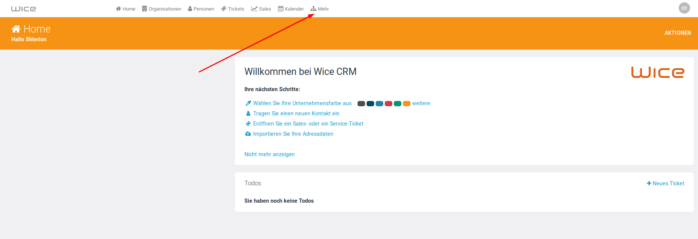
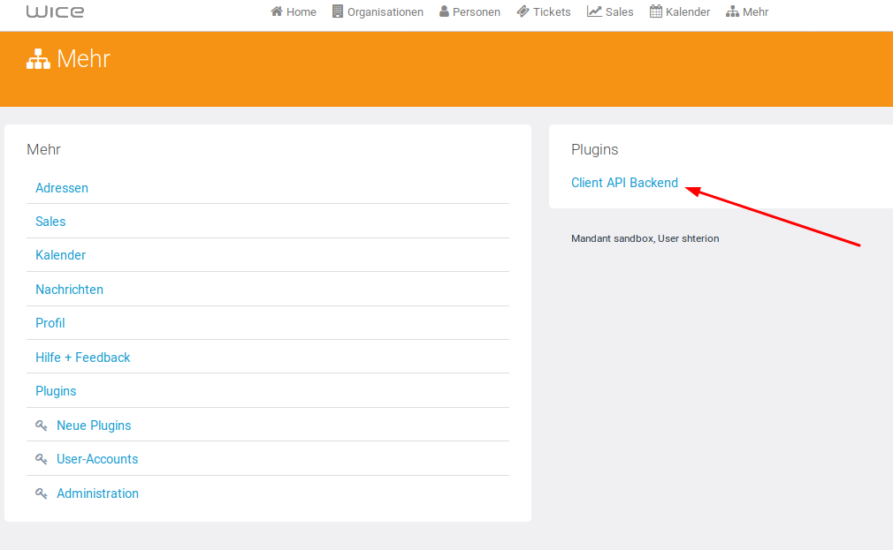
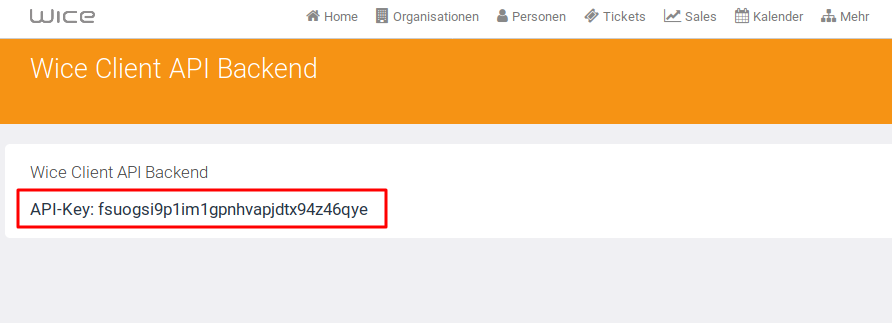

# Wice CRM API

[](https://travis-ci.com/shterion/wice-client-api) [](https://opensource.org/licenses/Apache-2.0)
[](https://GitHub.com/Naereen/StrapDown.js/graphs/commit-activity)

[Wice CRM](https://wice.de/) is a CRM Software which offers different modules for address management, tasks management, project management, calendars and a knowledge base for knowledge management. The software could be used to manage sales opportunities and offers too. In addition, [Wice CRM](https://wice.de/) offers the possibility to manage and create invoices, open items and incoming payments.

## Before you begin

Before you can use Wice Client API you **must be a registered Wice CRM user**. Please visit the home page of [Wice CRM](https://wice.de/register) to sign up.
> Any attempt to reach [Wice CRM](https://wice.de/) endpoints without registration will not be successful!

After you are already registered in [Wice CRM](https://wice.de/) you have to generate your **API Key**.
> For activation you **have to be logged in**, then click on ``Admin`` and under ```Plugins``` click on ``Wice Client API backend``. Once you are in, click on ``Create new`` to generate your API key.


***

***


Once the activation is done you have an access to **API Key** which is required for an authentication when you make a request to [Wice CRM](https://wice.de/).

## Installation
To install the service locally run `npm install` to install all dependencies and then `npm start`. The service must be accessible on `http://localhost:5000/`


## Authentication

Wice Client API expects a custom header - `X-WICE-SERVER`. This means that each request to Wice Client API must contain the header `X-WICE-SERVER` which is the server your are sending the request to. The header should look like:
- `X-WICE-SERVER`: [demo.wice-net.de](https://demo.wice-net.de/)
- `X-WICE-SERVER`: [node62.wice-net.de](https://node62.wice-net.de)  

After you are successfully logged in, you receive a `cookie` which you have to attach in each request in the header as `X-WICE-COOKIE` and the server you pointing to - `X-WICE-SERVER`. Don't forget to send your `APIKey` as `X-API-KEY` as well.

## Swagger

You could test **Wice Client API** with [Swagger](https://swagger.io/) on [api-docs.wice-net.de](https://api-docs.wice-net.de/).
First you have to specify the server, which you are sending your requests to. You could save your headers in the section **'Authorize'** - `X-WICE-SERVER`, `X-WICE-COOKIE` and `X-WICE-KEY`.

## Endpoints

At this point of time the API supports the following endpoints:

###### User management
- `​POST /api​/v1​/users​/login` - it returns `cookie` if login is successful

###### Person actions
- `GET /api​/v1​/persons` - it returns an array of objects with all persons
- `​POST /api​/v1​/persons` - it returns the new created person
- `GET /api​/v1​/persons/{rowid}` - it returns a person by a given `rowid`
- `PUT /api​/v1​/persons/{rowid}` - it returns the updated person
- `DELETE /api​/v1​/persons/{rowid}` - it returns the deleted person

###### Organization actions
- `GET /api​/v1​/organizations` - it returns an array of objects with all organizations
- `​POST /api​/v1​/organizations` - it returns the new created organization
- `GET /api​/v1​/organizations/{rowid}` - it returns an organization by a given `rowid`
- `PUT /api​/v1​/organizations/{rowid}` - it returns the updated organization
- `DELETE /api​/v1​/organizations/{rowid}` - it returns the deleted organization

###### Article actions
- `GET /api​/v1​/articles` - it returns an array of objects with all articles
- `​POST /api​/v1​/articles` - it returns the new created article
- `GET /api​/v1​/articles/{rowid}` - it returns an article by a given `rowid`
- `PUT /api​/v1​/articles/{rowid}` - it returns the updated article
- `DELETE /api​/v1​/articles/{rowid}` - it returns  the deleted article

## License

Apache-2.0 © [Wice GmbH](https://wice.de/)
