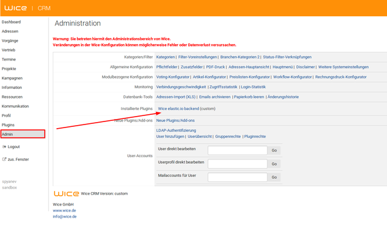
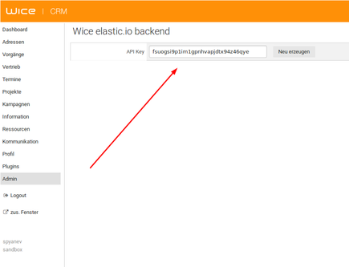

# Wice CRM API

[Wice CRM](https://wice.de/) is a CRM Software which offers different modules for address management, tasks management, project management, calendars and a knowledge base for knowledge management. The software could be used to manage sales opportunities and offers too. In addition, [Wice CRM](https://wice.de/) offers the possibility to manage and create invoices, open items and incoming payments.


## Before you begin

Before you can use our API you **must be a registered Wice CRM user**. Please visit the home page of [Wice CRM](https://wice.de/) to sign up.
> Any attempt to reach [Wice CRM](https://wice.de/) endpoints without registration will not be successful!

After you are already registered in [Wice CRM](https://wice.de/) you have to generate your **API Key**.
> For activation you **have to be logged in**, then click of ``Admin`` and under ```Plugins``` click of ``Wice OIH backend``. Once you are in click the button ``Create new`` to generate your API key.


***


Once the activation is done you have an access to **API Key** which is required for an authentication when you make a request to [Wice CRM](https://wice.de/).

## Installation
To install the service locally run `npm install` to install all dependencies and then `npm start`. The service must be accessible on `http://localhost:5000/`.

## Authentication

After you are successfully logged in, you receive a `cookie` which you have to send in the header as `wice-cookie` and don't forget to send your `APIKey` as `X-API-KEY` as well.

## Endpoints

At this point of time the API supports the following endpoints:

###### User management
- `​POST /api​/v1​/users​/login` - it returns `cookie` if login is successful

###### Person actions
- `GET /api​/v1​/persons` - it returns an array of objects with all persons
- `​POST /api​/v1​/persons` - it returns the new created person
- `GET /api​/v1​/persons/{rowid}` - it returns a person by a given `rowid`
- `PUT /api​/v1​/persons/{rowid}` - it returns the updated person
- `DELETE /api​/v1​/persons/{rowid}` - it returns the deleted person

###### Organization actions
- `GET /api​/v1​/organizations` - it returns an array of objects with all organizations
- `​POST /api​/v1​/organizations` - it returns the new created organization
- `GET /api​/v1​/organizations/{rowid}` - it returns an organization by a given `rowid`
- `PUT /api​/v1​/organizations/{rowid}` - it returns the updated organization
- `DELETE /api​/v1​/organizations/{rowid}` - it returns the deleted organization

###### Article actions
- `GET /api​/v1​/articles` - it returns an array of objects with all articles
- `​POST /api​/v1​/articles` - it returns the new created article
- `GET /api​/v1​/articles/{rowid}` - it returns an article by a given `rowid`
- `PUT /api​/v1​/articles/{rowid}` - it returns the updated article
- `DELETE /api​/v1​/articles/{rowid}` - it returns  the deleted article
